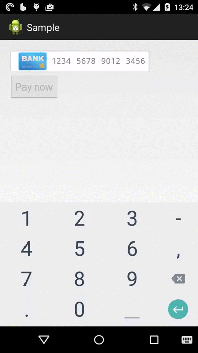

SwipeCardEntry
==============

What is this?
-------------

SwipeCardEntry takes the simple, elegant credit card entry UI of Swipe and ports this to
the Android Platform. In a nutshell SwipeCardEntry has:

* Support for Visa, Mastercard & American Express cards.
* Number validation using Luhn algorithm ensures the user will not enter an invalid number.
* Date validation ensures the user can only enter a valid expiry date.

SwipeCardEntry really is just a space saving, intuitive UI for card entry:

Installation
------------

Just copy over the SwipeCardEntryLibrary to your AndroidStudio project & add as a dependency.

General use
-----------

Simply add the view to your layout file:

<com.rethoughtsolutions.swipecardentry.SwipeCardEntry
    android:id="@+id/swipecardentry"
    android:layout_width="wrap_content"
    android:layout_height="wrap_content"
    android:background="@android:drawable/editbox_background_normal" />

And add a listener for when the user has successfully entered a credit card:

findViewById(R.id.swipecard).setListener(new SwipeCardEntry.Listener() {
    @Override
    public void onCardEntryCompleted(boolean completed) {
        //...
    }
});

